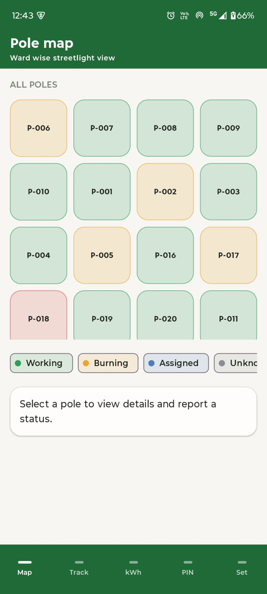
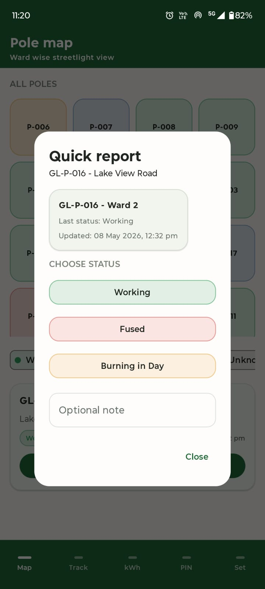
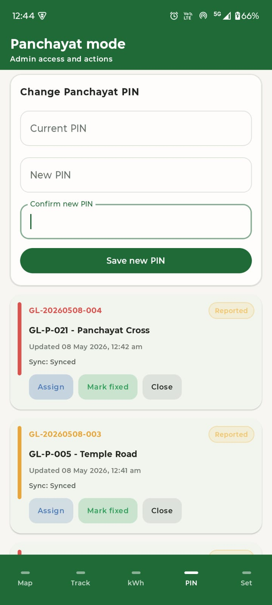
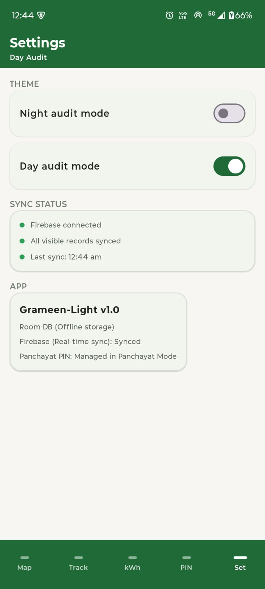
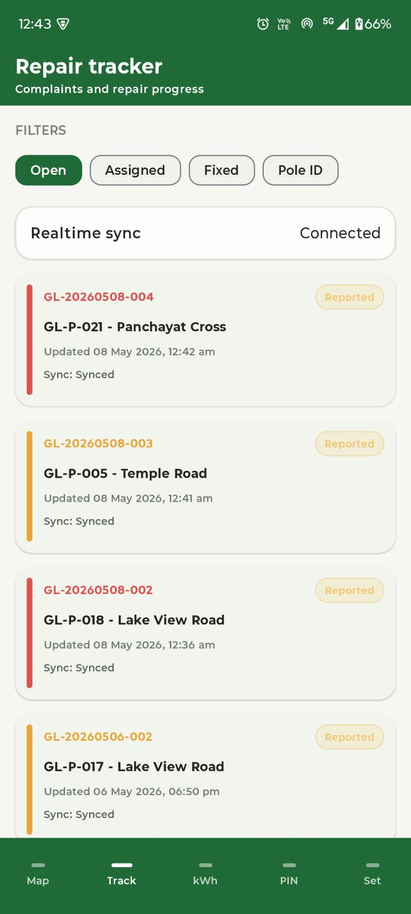
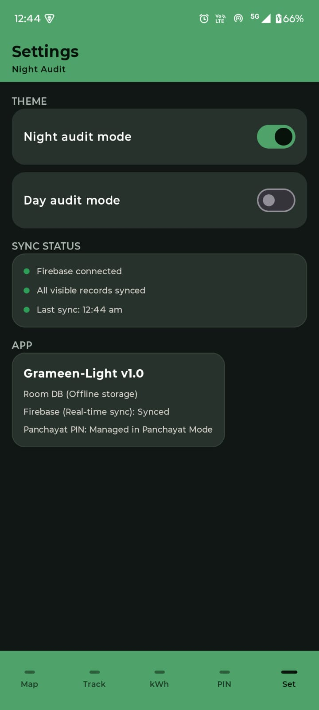
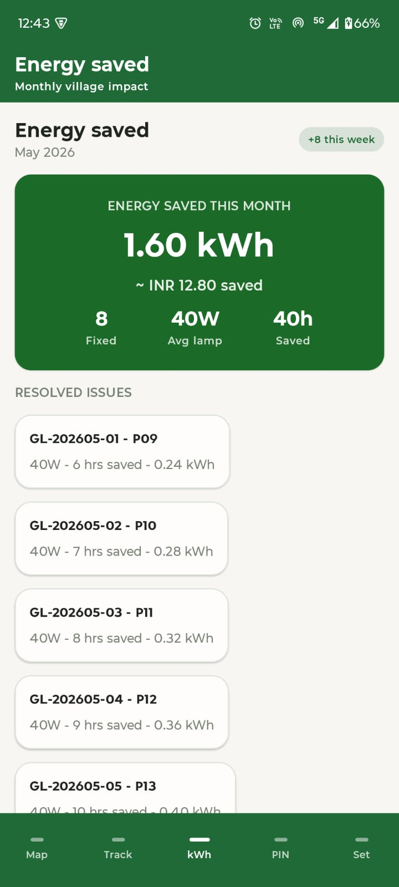

# Grameen-Light (Energy)

Grameen-Light (Energy) is an Android application for village streetlight issue reporting and repair tracking. It is designed for two user groups:

- **Residents**, who report streetlight conditions quickly
- **Panchayat admin users**, who assign, fix, and close complaints

The project is built as an **offline-first** Android app. Complaint data is saved locally in **Room Database** first, and then synced to **Firebase Firestore** when internet and Firebase configuration are available.

## Problem Statement

Streetlight complaints in villages are often handled manually through calls, verbal communication, or notebooks. This creates problems such as:

- no clear complaint tracking
- difficulty identifying which pole has an issue
- delays in assigning and closing repair work
- poor visibility into daytime-burning lamps and energy waste

Grameen-Light addresses this by providing a simple Android app for reporting, tracking, and energy-impact monitoring.

## Core Features

- Pole map with 25 seeded streetlight poles
- Status-based poles: `Working`, `Fused`, `Burning in Day`, `Assigned`, `Unknown`
- Quick report flow with minimal input
- Complaint ID generation in `GL-YYYYMMDD-NNN` format
- Repair tracker with `Open`, `Assigned`, `Fixed`, and `Pole ID` filters
- Panchayat mode protected by a 4-digit PIN
- Energy saved summary for fixed daytime-burning complaints
- Day audit / night audit theme switching with persistence
- Offline-first Room storage
- Firebase-ready real-time sync with `Pending`, `Synced`, and `Failed` states
- Fallback Panchayat summary when live AI is unavailable

## Tech Stack

- Kotlin
- Android Studio
- Jetpack Compose
- Material Design 3
- MVVM Architecture
- Room Database
- Firebase Firestore
- Kotlin StateFlow

## Architecture and Data Flow

The project follows strict MVVM layering:

`UI -> ViewModel -> Repository -> DAO -> Room Database`

Room is the **local source of truth**. Firebase Firestore acts as the **remote sync layer**.

### Request Flow

1. User interacts with the Compose UI
2. UI sends events to a ViewModel
3. ViewModel delegates logic to a Repository
4. Repository reads or writes through DAO interfaces
5. DAO updates Room Database locally
6. Repository attempts Firebase sync when possible

## Project Structure

```text
GrameenLight/
|-- app/
|   |-- src/main/java/com/grameenlight/app/
|   |   |-- data/
|   |   |   |-- local/
|   |   |   |-- model/
|   |   |   `-- repository/
|   |   |-- ui/
|   |   |   |-- screens/
|   |   |   |-- theme/
|   |   |   `-- viewmodel/
|   |   |-- AppContainer.kt
|   |   |-- AppSyncManager.kt
|   |   |-- GrameenLightApplication.kt
|   |   `-- MainActivity.kt
|   `-- build.gradle.kts
|-- gradle/
|-- build.gradle.kts
|-- settings.gradle.kts
`-- README.md
```

## Setup Requirements

- Windows with Android Studio installed
- Android SDK for API 28 or above
- Java toolchain supported by the Android Gradle Plugin in the project
- Android emulator or physical Android device

## Open and Run in Android Studio

1. Open Android Studio
2. Select **Open**
3. Choose the project folder:

   `C:\Users\Jyoti\AndroidStudioProjects\GrameenLight`

4. Let Gradle sync finish
5. Connect a device or start an emulator
6. Run the `app` configuration

## Build from Command Line

```powershell
.\gradlew.bat :app:assembleDebug
```

Debug APK output:

```text
app/build/outputs/apk/debug/app-debug.apk
```

Build verification:

- `.\gradlew.bat :app:assembleDebug` completed successfully

## Firebase Setup

The app works without Firebase in **local offline-first mode**.

To enable Firestore sync:

1. Create your Firebase project
2. Add an Android app with package name `com.grameenlight.app`
3. Download `google-services.json`
4. Place it in:

   `app/google-services.json`

5. Create Firestore and publish valid rules
6. Rebuild and run the app

### Important Note

`google-services.json` is intentionally **not committed** to this repository. Without that file, the app still works locally using Room Database, but real cloud sync will not activate.

Detailed setup steps:

- [Firebase Setup Guide](docs/FIREBASE_SETUP.md)

## Demo Notes

- Default Panchayat demo PIN: `1234`
- Complaint IDs are generated automatically
- Offline reports are saved locally first
- Energy is calculated for fixed `Burning in Day` complaints only
- Approximate INR saved uses a demo assumption of `INR 8 per kWh`

## Application Screenshots

### Pole Map



### Quick Report



### Repair Tracker



### Panchayat Mode



### Energy Saved



### Settings - Dark Theme



### Settings - Light Theme


### GenAI Summary



## Basic Usage Flow

1. Open the app to view the Pole Map
2. Select a pole to inspect its current status
3. Submit a Quick Report using `Working`, `Fused`, or `Burning in Day`
4. Track the complaint from the Repair Tracker screen
5. Use Panchayat Mode to assign or fix complaints
6. View monthly impact from the Energy Saved screen

## Additional Documentation

- [Project Flow](docs/PROJECT_FLOW.md)
- [Firebase Setup Guide](docs/FIREBASE_SETUP.md)

## Future Improvements

- Real authentication for admin users
- GPS-based live pole location
- WorkManager-based background sync retry
- Production Firebase rules
- Analytics and usage reporting
- Village-level scaling with live field data
